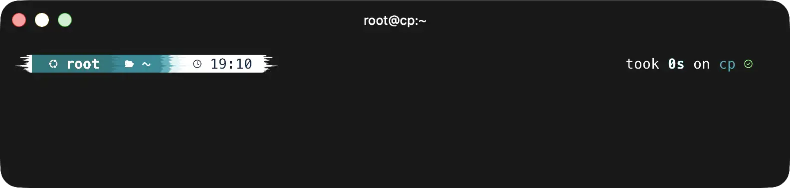
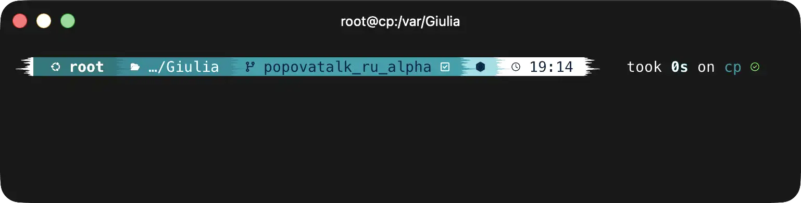

# Viking Theme for Starship

An Arctic-inspired theme embodying the essence of Scandinavian frost. This theme features icy blues and crisp whites that evoke the chill of Nordic winters, perfect for cold Swedish servers.

## Usage

Copy the palette to your Starship configuration file.

### Tip

Check out this example Starship configuration for how to define and use colors from custom palettes.

### Note

Looking for inspiration or ready-made presets? Visit the Show & Tell discussions to browse and share community-made themes!

## Screenshots

## Configuration

The theme uses a distinctive powerline-style design with smooth color transitions from deep ocean blues to bright white accents. Perfect for developers who enjoy clean, modern aesthetics with a touch of Scandinavian minimalism.

## Copyright

© Unknown author